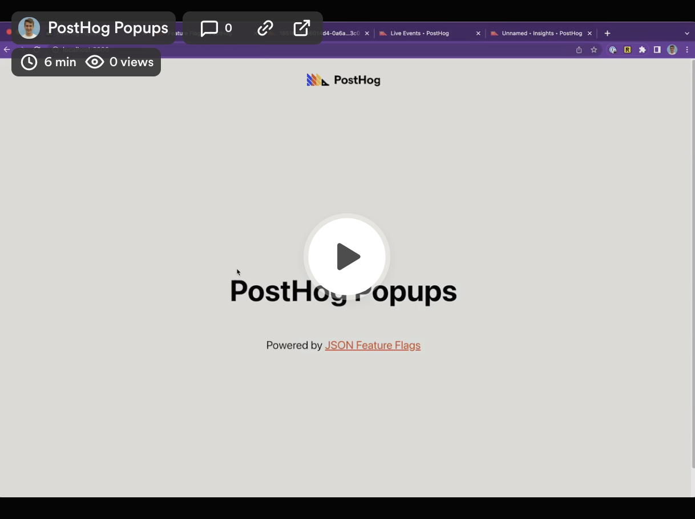
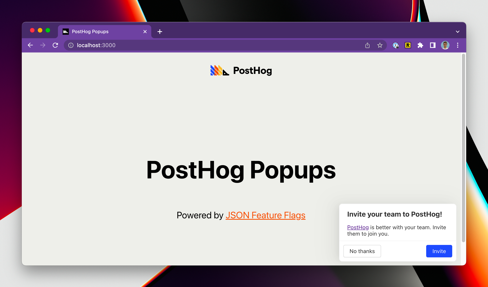

# PostHog Popups

Create and control in-app popups on PostHog

[](https://www.loom.com/share/548c7d93abb64bbe9ebbf3031ec37f97)



## Popup features

The features include:

1. Create popups and dynamically control the popup text, location, buttons and links all from PostHog
2. Style the component to fully match your app
3. Include HTML in the popup body, including links and images
4. Customize who sees the popups by cohorts or user properties
5. A/B test different popups to find which has the biggest impact
6. Full extensibility of additional fields and buttons

For now, if you want to target a cohort based on behaviors you'll need to create a dynamic cohort, then export the CSV and use it to create a static cohort that you then target with the feature flag. We're working on a better solution for this.

## Libraries/Languages supported

You can control popups in all libraries that support PostHog feature flags. The following libraries have example code and boilerplate to get you started, for the others you'll need to create your own implementation of the frontend popup:

- [React](./react/README.md)
- Contributions welcome for the other libraries!

## Creating a popup in PostHog

1. (Required) Install the code from the example code e.g. [react](./react/README.md) or create your own popup implementation using our demos as inspiration
2. Create the feature flag and call it `popup-{unique name}` (or create it as an experiment)
3. Add the JSON payload (see Default feature flag schema for examples)
4. Configure the users that you want to see the popup
5. Add an extra filter to exclude users with the property `$popup-{unique name}` set so that the popup is only shown once for each user
6. Turn on the flag to activate the popup!

## Default feature flag schema

```
{
    "title": string,
    "body": string (can contain html),
    "primaryButtonText": string,
    "primaryButtonURL": url,
    "secondaryButtonText": string,
    "location": "absolute-(bottom-right | bottom-left | top-right | top-left | center) or relative-(top | bottom | left | right)
    "locationCSSSelector": CSS Selector IF location is "relative-"
}
```

## Default events sent

| Event | Description | Properties |
| --- | --- | --- |
| popup shown | When the popup is shown to the user |     flag: `popup-{unique name}`, payload: the feature flag payload |
| popup dismissed | When the popup is dismissed by the user | flag: `popup-{unique name}`, payload: the feature flag payload, buttonType: `primary` or `secondary` |
